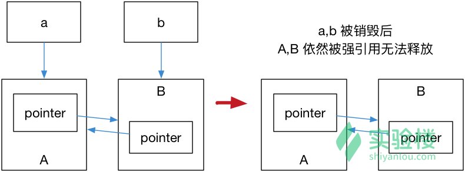
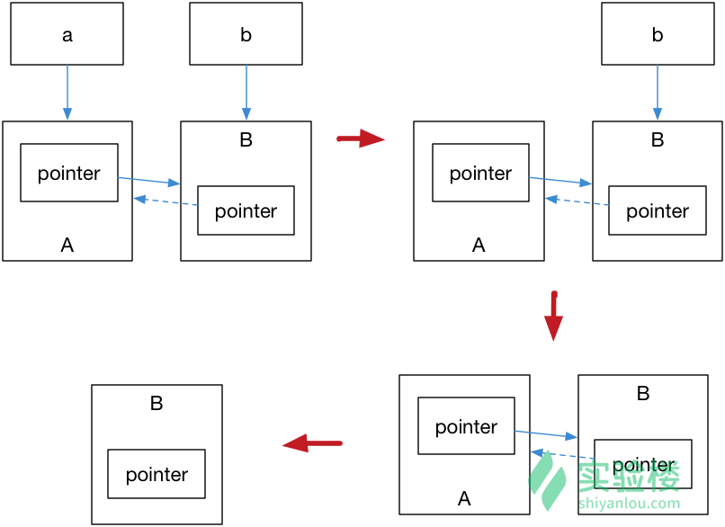
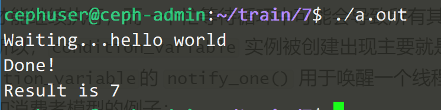
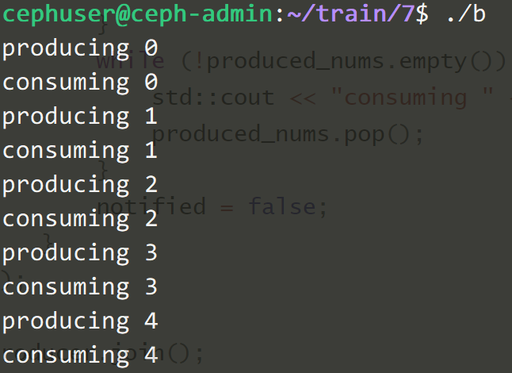

# C++11/14 对标准库的扩充: 新增容器

## std::array 和 std::forward_list

### std::array

看到这个容器的时候肯定会出现这样的问题：

1. 为什么要引入 `std::array` 而不是直接使用 `std::vector`？

   答：std::vecotr` 太强大了，以至于我们没有必要为了去敲碎一个鸡蛋而用一个钉锤。使用 `std::array`保存在栈内存中，相比堆内存中的 `std::vector`，我们就能够灵活的访问这里面的元素，从而获得更高的性能；同时正式由于其堆内存存储的特性，有些时候我们还需要自己负责释放这些资源。

2. 已经有了传统数组，为什么要用 `std::array`?

   答：而第二个问题就更加简单，使用`std::array`能够让代码变得更加现代，且封装了一些操作函数，同时还能够友好的使用标准库中的容器算法等等，比如 `std::sort`。

`std::array` 会在编译时创建一个固定大小的数组，`std::array` 不能够被隐式的转换成指针，使用 `std::array`很简单，只需指定其类型和大小即可。

```c++
std::array<int, 4> arr= {1,2,3,4};

int len = 4;
std::array<int, len> arr = {1,2,3,4}; // 非法, 数组大小参数必须是常量表达式
```

当我们开始用上了 `std::array` 时，兼容 C 风格的接口的做法。

   1. 取array[0]地址
   2. 使用array.data()

```c++
void foo(int *p, int len) {
return;
}
std::array<int 4> arr = {1,2,3,4};
// C 风格接口传参
// foo(arr, arr.size());           // 非法, 无法隐式转换
foo(&arr[0], arr.size());
foo(arr.data(), arr.size());
// 使用 `std::sort`
std::sort(arr.begin(), arr.end());
```

### std::forward_list

`std::forward_list` 是一个列表容器，使用方法和 `std::list`基本类似

其和 `std::list` 的双向链表的实现不同，`std::forward_list` 使用单向链表进行实现，提供了 `O(1)` 复杂度的元素插入，不支持快速随机访问（这也是链表的特点），也是标准库容器中唯一一个不提供 `size()` 方法的容器。当不需要双向迭代时，具有比 `std::list` 更高的空间利用率。

## 无序容器

`std::map`/`std::set`内部通过红黑树进行实现，插入和搜索的平均复杂度均为 `O(log(size))`。在插入元素时候，会根据 `<` 操作符比较元素大小并判断元素是否相同，并选择合适的位置插入到容器中。当对这个容器中的元素进行遍历时，输出结果会按照 `<` 操作符的顺序来逐个遍历。

而无序容器中的元素是不进行排序的，内部通过 Hash 表实现，插入和搜索元素的平均复杂度为 `O(constant)`，在不关心容器内部元素顺序时，能够获得显著的性能提升。

C++11 引入了两组无序容器：

`std::unordered_map`/`std::unordered_multimap` 

 `std::unordered_set`/`std::unordered_multiset`

用法和原有的 `std::map`/`std::multimap`/`std::set`/`set::multiset` 基本类似

比较`std::map`和`std::multimap`：

```c++
#include <iostream>
#include <string>
#include <unordered_map>
#include <map>

int main() {
    // 两组结构按同样的顺序初始化
    std::unordered_map<int, std::string> u = {
        {1, "1"},
        {3, "3"},
        {2, "2"}
    };
    std::map<int, std::string> v = {
        {1, "1"},
        {3, "3"},
        {2, "2"}
    };

    // 分别对两种容器进行遍历
    std::cout << "std::unordered_map" << std::endl;
    for( const auto & n : u) 
        std::cout << "Key:[" << n.first << "] Value:[" << n.second << "]\n";

    std::cout << std::endl;
    std::cout << "std::map" << std::endl;
    for( const auto & n : v) 
        std::cout << "Key:[" << n.first << "] Value:[" << n.second << "]\n";
}
```

最终的输出结果为：

```c++
std::unordered_map
Key:[2] Value:[2]
Key:[3] Value:[3]
Key:[1] Value:[1]

std::map
Key:[1] Value:[1]
Key:[2] Value:[2]
Key:[3] Value:[3]
```

可以看出`map`对其进行了排序，而`unordered_map`则不对其进行排序。

## 元组 std::tuple

### 元组基本操作

关于元组的使用有三个核心的函数：

1. `std::make_tuple`: 构造元组
2. `std::get`: 获得元组某个位置的值
3. `std::tie`: 元组拆包

```c++
#include <tuple>
#include <iostream>

auto get_student(int id)
{
    // 返回类型被推断为 std::tuple<double, char, std::string>

    if (id == 0)
        return std::make_tuple(3.8, 'A', "张三");
    if (id == 1)
        return std::make_tuple(2.9, 'C', "李四");
    if (id == 2)
        return std::make_tuple(1.7, 'D', "王五");
    return std::make_tuple(0.0, 'D', "null");   
    // 如果只写 0 会出现推断错误, 编译失败
}

int main()
{
    auto student = get_student(0);
    std::cout << "ID: 0, "
    << "GPA: " << std::get<0>(student) << ", "
    << "成绩: " << std::get<1>(student) << ", "
    << "姓名: " << std::get<2>(student) << '\n';

    double gpa;
    char grade;
    std::string name;

    // 元组进行拆包
    std::tie(gpa, grade, name) = get_student(1);
    std::cout << "ID: 1, "
    << "GPA: " << gpa << ", "
    << "成绩: " << grade << ", "
    << "姓名: " << name << '\n';
}
```

`std::get` 除了使用常量获取元组对象外，C++14 增加了使用类型来获取元组中的对象（感觉用处不大，无法获取重复的类型）：

```c++
std::tuple<std::string, double, double, int> t("123", 4.5, 6.7, 8);
std::cout << std::get<std::string>(t) << std::endl;
std::cout << std::get<double>(t) << std::endl;   // 非法, 引发编译期错误
std::cout << std::get<3>(t) << std::endl;
```

### 运行期索引

如果你仔细思考一下可能就会发现上面代码的问题，`std::get<>` 依赖一个编译期的常量，所以下面的方式是不合法的：

```c++
int index = 1;
std::get<index>(t);
```

那么要怎么处理？答案是，**标准库做不到**。这里介绍一个使用 `boost::variant` 配合变长模板参数的黑魔法：

> **提示**：使用 `boost` 只是暂时性的解决方案，`variant` 已在 C++17 中被纳入标准库 `std::variant`，见扩展主题它的讨论。<http://en.cppreference.com/w/cpp/utility/variant>

```c++
#include <boost/variant.hpp>
template <size_t n, typename... T>
boost::variant<T...> _tuple_index(size_t i, const std::tuple<T...>& tpl) {
    if (i == n)
        return std::get<n>(tpl);
    else if (n == sizeof...(T) - 1)
        throw std::out_of_range("越界.");
    else
        return _tuple_index<(n < sizeof...(T)-1 ? n+1 : 0)>(i, tpl);
}
template <typename... T>
boost::variant<T...> tuple_index(size_t i, const std::tuple<T...>& tpl) {
    return _tuple_index<0>(i, tpl);
}
```

这样我们就能：

```c++
int i = 1;
std::cout << tuple_index(i, t) << std::endl;
```

### 元组合并与遍历

还有一个常见的需求就是合并两个元组，这可以通过 `std::tuple_cat` 来实现：

```c++
auto new_tuple = std::tuple_cat(get_student(1), std::move(t));//此处为何要加move？
```

马上就能够发现，应该如何快速遍历一个元组？但是我们刚才介绍了如何在运行期通过非常数索引一个 `tuple` 那么遍历就变得简单了，首先我们需要知道一个元组的长度，可以：

```c++
template <typename T>
auto tuple_len(T &tpl) {
    return std::tuple_size<T>::value;
}
```

这样就能够对元组进行迭代了：

```c++
// 迭代
for(int i = 0; i != tuple_len(new_tuple); ++i)
    // 运行期索引
    std::cout << tuple_index(i, new_tuple) << std::endl;
```

`std::tuple` 虽然有效，但是标准库提供的功能有限，没办法满足运行期索引和迭代的需求，好在我们还有其他的方法可以自行实现。

# 对标准库的扩充: 智能指针和引用计数

## RAII 与引用计数

引用计数这种计数是为了防止内存泄露而产生的。基本想法是对于动态分配的对象，进行引用计数，每当增加一次对同一个对象的引用，那么引用对象的引用计数就会增加一次，每删除一次引用，引用计数就会减一，当一个对象的引用计数减为零时，就自动删除指向的堆内存。

在传统 C++ 中，『记得』手动释放资源，总不是最佳实践。因为我们很有可能就忘记了去释放资源而导致泄露。所以通常的做法是对于一个对象而言，我们在构造函数的时候申请空间，而在析构函数（在离开作用域时调用）的时候释放空间，也就是我们常说的 RAII 资源获取即初始化技术。

凡事都有例外，我们总会有需要将对象在自由存储上分配的需求，在传统 C++ 里我们只好使用 `new` 和 `delete` 去『记得』对资源进行释放。而 C++11 引入了智能指针的概念，使用了引用计数的想法，让程序员不再需要关心手动释放内存。这些智能指针就包括 `std::shared_ptr`/`std::unique_ptr`/`std::weak_ptr`，使用它们需要包含头文件 `<memory>`。

> 注意：引用计数不是垃圾回收，引用技术能够尽快收回不再被使用的对象，同时在回收的过程中也不会造成长时间的等待，更能够清晰明确的表明资源的生命周期。

## std::shared_ptr

`std::shared_ptr` 是一种智能指针，它能够记录多少个 `shared_ptr` 共同指向一个对象，从而消除显示的调用 `delete`，当引用计数变为零的时候就会将对象自动删除。

但还不够，因为使用 `std::shared_ptr` 仍然需要使用 `new` 来调用，这使得代码出现了某种程度上的不对称。

`std::make_shared` 就能够用来消除显示的使用 `new`，所以`std::make_shared` 会分配创建传入参数中的对象，并返回这个对象类型的`std::shared_ptr`指针。例如：

```c++
#include <iostream>
#include <memory>

void foo(std::shared_ptr<int> i)
{
    (*i)++;
}
int main()
{
    // auto pointer = new int(10); // 非法, 不允许直接赋值
    // 构造了一个 std::shared_ptr
    auto pointer = std::make_shared<int>(10);
    foo(pointer);
    std::cout << *pointer << std::endl; // 11

    // 离开作用域前，shared_ptr 会被析构，从而释放内存
    return 0;
}
```

`std::shared_ptr` 可以通过 `get()` 方法来获取原始指针，通过 `reset()` 来减少一个引用计数，并通过`get_count()`来查看一个对象的引用计数。例如：

```c++
auto pointer = std::make_shared<int>(10);
auto pointer2 = pointer;    // 引用计数+1
auto pointer3 = pointer;    // 引用计数+1
int *p = pointer.get();     // 这样不会增加引用计数

std::cout << "pointer.use_count() = " << pointer.use_count() << std::endl;      // 3
std::cout << "pointer2.use_count() = " << pointer2.use_count() << std::endl;    // 3
std::cout << "pointer3.use_count() = " << pointer3.use_count() << std::endl;    // 3

pointer2.reset();
std::cout << "reset pointer2:" << std::endl;
std::cout << "pointer.use_count() = " << pointer.use_count() << std::endl;      // 2
std::cout << "pointer2.use_count() = " << pointer2.use_count() << std::endl;    // 0, pointer2 已 reset
std::cout << "pointer3.use_count() = " << pointer3.use_count() << std::endl;    // 2

pointer3.reset();
std::cout << "reset pointer3:" << std::endl;
std::cout << "pointer.use_count() = " << pointer.use_count() << std::endl;      // 1
std::cout << "pointer2.use_count() = " << pointer2.use_count() << std::endl;    // 0
std::cout << "pointer3.use_count() = " << pointer3.use_count() << std::endl;    // 0, pointer3 已 reset
```

## std::unique_ptr

`std::unique_ptr` 是一种独占的智能指针，它禁止其他智能指针与其共享同一个对象，从而保证了代码的安全：

```c++
std::unique_ptr<int> pointer = std::make_unique<int>(10);   // make_unique 从 C++14 引入
std::unique_ptr<int> pointer2 = pointer;    // 非法
```

> make_unique 并不复杂，C++11 没有提供 std::make_unique，可以自行实现：
>
> ```c++
> template<typename T, typename ...Args>
> std::unique_ptr<T> make_unique( Args&& ...args ) {
>     return std::unique_ptr<T>( new T( std::forward<Args>(args)... ) );
> }
> ```
>
> 至于为什么没有提供，C++ 标准委员会主席 Herb Sutter 在他的[博客](https://herbsutter.com/gotw/_102/)中提到原因是因为『被他们忘记了』。

既然是独占，换句话说就是不可复制。但是，我们可以利用 `std::move` 将其转移给其他的 `unique_ptr`，例如：

```c++
#include <iostream>
#include <memory>

struct Foo {
    Foo()      { std::cout << "Foo::Foo" << std::endl;  }
    ~Foo()     { std::cout << "Foo::~Foo" << std::endl; }
    void foo() { std::cout << "Foo::foo" << std::endl;  }
};

void f(const Foo &) {
    std::cout << "f(const Foo&)" << std::endl;
}

int main() {
    std::unique_ptr<Foo> p1(std::make_unique<Foo>());

    // p1 不空, 输出
    if (p1) p1->foo();
    {
        std::unique_ptr<Foo> p2(std::move(p1));

        // p2 不空, 输出
        f(*p2);

        // p2 不空, 输出
        if(p2) p2->foo();

        // p1 为空, 无输出
        if(p1) p1->foo();

        p1 = std::move(p2);

        // p2 为空, 无输出
        if(p2) p2->foo();
        std::cout << "p2 被销毁" << std::endl;
    }
    // p1 不空, 输出
    if (p1) p1->foo();

    // Foo 的实例会在离开作用域时被销毁
}
```

## std::weak_ptr

如果你仔细思考 `std::shared_ptr` 就会发现依然存在着资源无法释放的问题。看下面这个例子：

```c++
#include <iostream>
#include <memory>

class A;
class B;

class A {
public:
    std::shared_ptr<B> pointer;
    ~A() {
        std::cout << "A 被销毁" << std::endl;
    }
};
class B {
public:
    std::shared_ptr<A> pointer;
    ~B() {
        std::cout << "B 被销毁" << std::endl;
    }
};
int main() {
    std::shared_ptr<A> a = std::make_shared<A>();
    std::shared_ptr<B> b = std::make_shared<B>();
    a->pointer = b;
    b->pointer = a;

    return 0;
}
```

运行结果是 A, B 都不会被销毁，这是因为 a,b 内部的 pointer 同时又引用了 `a,b`，这使得 `a,b` 的引用计数均变为了 2，而离开作用域时，`a,b` 智能指针被析构，却智能造成这块区域的引用计数减一，这样就导致了 `a,b` 对象指向的内存区域引用计数不为零，而外部已经没有办法找到这块区域了，也就造成了内存泄露，如图所示：



解决这个问题的办法就是使用弱引用指针 `std::weak_ptr`，`std::weak_ptr`是一种弱引用（相比较而言 `std::shared_ptr`就是一种强引用）。弱引用不会引起引用计数增加，当换用弱引用时候，最终的释放流程如下图所示：



在上图中，最后一步只剩下 B，而 B 并没有任何智能指针引用它，因此这块内存资源也会被释放。

`std::weak_ptr` 没有 `*` 运算符和 `->` 运算符，所以不能够对资源进行操作，它的唯一作用就是用于检查 `std::shared_ptr`是否存在，`expired()` 方法在资源未被释放时，会返回 `true`，否则返回 `false`。

正确的代码如下：

```c++
#include <iostream>
#include <memory>

class A;
class B;

class A {
public:
    // A 或 B 中至少有一个使用 weak_ptr
    std::weak_ptr<B> pointer;
    ~A() {
        std::cout << "A 被销毁" << std::endl;
    }
};
class B {
public:
    std::shared_ptr<A> pointer;
    ~B() {
        std::cout << "B 被销毁" << std::endl;
    }
};
int main() {
    std::shared_ptr<A> a = std::make_shared<A>();
    std::shared_ptr<B> b = std::make_shared<B>();
    a->pointer = b;
    b->pointer = a;

    return 0;
}
```

## std::regex 及其相关

对字符串内容进行匹配的最常见手段就是使用正则表达式。可惜在传统 C++ 中正则表达式一直没有得到语言层面的支持，没有纳入标准库，而 C++ 作为一门高性能语言，在后台服务的开发中，对 URL 资源链接进行判断时，使用正则表达式也是工业界最为成熟的普遍做法。

一般的解决方案就是使用 `boost` 的正则表达式库。而 C++11 正式将正则表达式的的处理方法纳入标准库的行列，从语言级上提供了标准的支持，不再依赖第三方。

C++11 提供的正则表达式库操作 `std::string` 对象，模式 `std::regex` (本质是 `std::basic_regex`)进行初始化，通过 `std::regex_match` 进行匹配，从而产生 `std::smatch` （本质是 `std::match_results` 对象）。

我们通过一个简单的例子来简单介绍这个库的使用。考虑下面的正则表达式

- `[a-z]+\.txt`: 在这个正则表达式中, `[a-z]` 表示匹配一个小写字母, `+` 可以使前面的表达式匹配多次，因此 `[a-z]+` 能够匹配一个小写字母组成的字符串。在正则表达式中一个 `.` 表示匹配任意字符，而 `\.` 则表示匹配字符 `.`，最后的 `txt` 表示严格匹配 `txt` 则三个字母。因此这个正则表达式的所要匹配的内容就是由纯小写字母组成的文本文件。

`std::regex_match` 用于匹配字符串和正则表达式，有很多不同的重载形式。最简单的一个形式就是传入`std::string` 以及一个 `std::regex` 进行匹配，当匹配成功时，会返回 `true`，否则返回 `false`。例如：

```c++
#include <iostream>
#include <string>
#include <regex>

int main() {
    std::string fnames[] = {"foo.txt", "bar.txt", "test", "a0.txt", "AAA.txt"};
    // 在 C++ 中 `\` 会被作为字符串内的转义符，为使 `\.` 作为正则表达式传递进去生效，需要对 `\` 进行二次转义，从而有 `\\.`
    std::regex txt_regex("[a-z]+\\.txt");
    for (const auto &fname: fnames)
        std::cout << fname << ": " << std::regex_match(fname, txt_regex) << std::endl;
}
```

另一种常用的形式就是依次传入 `std::string`/`std::smatch`/`std::regex` 三个参数，其中 `std::smatch` 的本质其实是 `std::match_results`，在标准库中， `std::smatch` 被定义为了 `std::match_results<std::string::const_iterator>`，也就是一个子串迭代器类型的 `match_results`。使用 `std::smatch`可以方便的对匹配的结果进行获取，例如：

```c++
std::regex base_regex("([a-z]+)\\.txt");
std::smatch base_match;
for(const auto &fname: fnames) {
    if (std::regex_match(fname, base_match, base_regex)) {
        // sub_match 的第一个元素匹配整个字符串
        // sub_match 的第二个元素匹配了第一个括号表达式
        if (base_match.size() == 2) {
            std::string base = base_match[1].str();
            std::cout << "sub-match[0]: " << base_match[0].str() << std::endl;
            std::cout << fname << " sub-match[1]: " << base << std::endl;
        }
    }
}
```

以上两个代码段的输出结果为：

```
foo.txt: 1
bar.txt: 1
test: 0
a0.txt: 0
AAA.txt: 0
sub-match[0]: foo.txt
foo.txt sub-match[1]: foo
sub-match[0]: bar.txt
bar.txt sub-match[1]: bar
```

# 对标准库的扩充: 语言级线程支持

提示：有关多线程的代码编译需要使用 `-pthread` 选项，例如：

```shell
g++ main.cpp -std=c++14 -pthread
```

## std::thread

`std::thread` 用于创建一个执行的线程实例，所以它是一切并发编程的基础，使用时需要包含<thread>头文件，它提供了很多基本的线程操作，例如`get_id()`来获取所创建线程的线程 ID，例如使用 `join()` 来加入一个线程等等，例如：

```c++
#include <iostream>
#include <thread>
void foo() {
    std::cout << "hello world" << std::endl;
}
int main() {
    std::thread t(foo);
    t.join();//开始运行
    return 0;
}
```

## std::mutex, std::unique_lock

C++11引入了 mutex 相关的类，其所有相关的函数都放在 `<mutex>` 头文件中。

`std::mutex` 是 C++11 中最基本的 `mutex` 类，通过实例化 `std::mutex` 可以创建互斥量，而通过其成员函数 `lock()` 可以仅此能上锁，`unlock()` 可以进行解锁。但是在在实际编写代码的过程中，最好不去直接调用成员函数，因为调用成员函数就需要在每个临界区的出口处调用 `unlock()`，当然，还包括异常。这时候 C++11 还为互斥量提供了一个 RAII 语法的模板类`std::lock_gurad`。RAII 在不失代码简洁性的同时，很好的保证了代码的异常安全性。

在 RAII 用法下，对于临界区的互斥量的创建只需要在作用域的开始部分，例如：

```c++
void some_operation(const std::string &message) {
    static std::mutex mutex;
    std::lock_guard<std::mutex> lock(mutex);

    // ...操作

    // 当离开这个作用域的时候，互斥锁会被析构，同时unlock互斥锁
    // 因此这个函数内部的可以认为是临界区
}
```

由于 C++保证了所有栈对象在声明周期结束时会被销毁，所以这样的代码也是异常安全的。无论 `some_operation()` 正常返回、还是在中途抛出异常，都会引发堆栈回退，也就自动调用了 `unlock()`。

而 `std::unique_lock` 则相对于 `std::lock_guard` 出现的，`std::unique_lock` 更加灵活，`std::unique_lock` 的对象会以独占所有权（没有其他的 `unique_lock` 对象同时拥有某个 `mutex` 对象的所有权）的方式管理 `mutex` 对象上的上锁和解锁的操作。所以在并发编程中，推荐使用 `std::unique_lock`。例如：

```c++
#include <iostream>
#include <thread>
#include <mutex>

std::mutex mtx;

void block_area() {
    std::unique_lock<std::mutex> lock(mtx);
    //...临界区
}
int main() {
    std::thread thd1(block_area);

    thd1.join();

    return 0;
}
```

## std::future, std::packaged_task

`std::future` 则是提供了一个访问异步操作结果的途径，这句话很不好理解。为了理解这个特性，我们需要先理解一下在 C++11之前的多线程行为。

试想，如果我们的主线程 A 希望新开辟一个线程 B 去执行某个我们预期的任务，并返回我一个结果。而这时候，线程 A 可能正在忙其他的事情，无暇顾及 B 的结果，所以我们会很自然的希望能够在某个特定的时间获得线程 B 的结果。

在 C++11 的 `std::future` 被引入之前，通常的做法是：创建一个线程A，在线程A里启动任务 B，当准备完毕后发送一个事件，并将结果保存在全局变量中。而主函数线程 A 里正在做其他的事情，当需要结果的时候，调用一个线程等待函数来获得执行的结果。

而 C++11 提供的 `std::future` 简化了这个流程，可以用来获取异步任务的结果。自然地，我们很容易能够想象到把它作为一种简单的线程同步手段。

此外，`std::packaged_task` 可以用来封装任何可以调用的目标，从而用于实现异步的调用。例如：

```c++
#include <iostream>
#include <future>
#include <thread>

int main() {
    // 将一个返回值为7的 lambda 表达式封装到 task 中
    // std::packaged_task 的模板参数为要封装函数的类型
    std::packaged_task<int()> task([](){return 7;});
    // 获得 task 的 future
    std::future<int> result = task.get_future();    // 在一个线程中执行 task
    std::thread(std::move(task)).detach();
    std::cout << "Waiting...";
    result.wait();
    // 输出执行结果
    std::cout << "Done!" << std:: endl << "Result is " << result.get() << '\n';
}
```



在封装好要调用的目标后，可以使用 `get_future()` 来获得一个 `std::future` 对象，以便之后事实线程同步。

## std::condition_variable

`std::condition_variable` 是为了解决死锁而生的。当互斥操作不够用而引入的。比如，线程可能需要等待某个条件为真才能继续执行，而一个忙等待循环中可能会导致所有其他线程都无法进入临界区使得条件为真时，就会发生死锁。所以，`condition_variable` 实例被创建出现主要就是用于唤醒等待线程从而避免死锁。`std::condition_variable`的 `notify_one()` 用于唤醒一个线程；`notify_all()` 则是通知所有线程。下面是一个生产者和消费者模型的例子：

```c++
#include <condition_variable>
#include <mutex>
#include <thread>
#include <iostream>
#include <queue>
#include <chrono>

int main()
{
    // 生产者数量
    std::queue<int> produced_nums;
    // 互斥锁
    std::mutex m;
    // 条件变量
    std::condition_variable cond_var;
    // 结束标志
    bool done = false;
    // 通知标志
    bool notified = false;

    // 生产者线程
    std::thread producer([&]() {
        for (int i = 0; i < 5; ++i) {
            std::this_thread::sleep_for(std::chrono::seconds(1));
            // 创建互斥锁
            std::unique_lock<std::mutex> lock(m);
            std::cout << "producing " << i << '\n';
            produced_nums.push(i);
            notified = true;
            // 通知一个线程
            cond_var.notify_one();
        }   
        done = true;
        cond_var.notify_one();
    }); 

    // 消费者线程
    std::thread consumer([&]() {
        std::unique_lock<std::mutex> lock(m);
        while (!done) {
            while (!notified) {  // 循环避免虚假唤醒
                cond_var.wait(lock);
            }   
            while (!produced_nums.empty()) {
                std::cout << "consuming " << produced_nums.front() << '\n';
                produced_nums.pop();
            }   
            notified = false;
        }   
    }); 

    producer.join();
    consumer.join();
}
```



# noexcept 的修饰和操作

C++11 将异常的声明简化为以下两种情况：

1. 函数可能抛出任何异常
2. 函数不能抛出任何异常

并使用 `noexcept` 对这两种行为进行限制，例如：

```C++
void may_throw();           // 可能抛出异常
void no_throw() noexcept;   // 不可能抛出异常
```

使用 `noexcept` 修饰过的函数如果抛出异常，编译器会使用 `std::terminate()` 来立即终止程序运行。

`noexcept` 还能用作操作符，用于操作一个表达式，当表达式无异常时，返回 `true`，否则返回 `false`。

```C++
#include <iostream>

void may_throw() {
    throw true;
}
auto non_block_throw = []{
    may_throw();
};
void no_throw() noexcept {
    return;
}

auto block_throw = []() noexcept {
    no_throw();
};

int main()
{
    std::cout << std::boolalpha
    << "may_throw() noexcept? " << noexcept(may_throw()) << std::endl
    << "no_throw() noexcept? " << noexcept(no_throw()) << std::endl
    << "lmay_throw() noexcept? " << noexcept(non_block_throw()) << std::endl
    << "lno_throw() noexcept? " << noexcept(block_throw()) << std::endl;

    return 0;
}
```

`noexcept` 修饰完一个函数之后能够起到封锁异常扩散的功效，如果内部产生异常，外部也不会触发。例如：

```C++
try {
    may_throw();
} catch (...) {
    std::cout << "捕获异常, 来自 my_throw()" << std::endl;
}

try {
    non_block_throw();
} catch (...) {
    std::cout << "捕获异常, 来自 non_block_throw()" << std::endl;
}

try {
    block_throw();
} catch (...) {
    std::cout << "捕获异常, 来自 block_throw()" << std::endl;
}
```

最终输出为：

```
捕获异常, 来自 my_throw()
捕获异常, 来自 non_block_throw()
```

# 字面量

## 原始字符串字面量

传统 C++ 里面要编写一个充满特殊字符的字符串其实是非常痛苦的一件事情，比如一个包含 HTML 本体的字符串需要添加大量的转义符，例如一个Windows 上的文件路径经常会：`C:\\What\\The\\Fxxk`。

C++11 提供了原始字符串字面量的写法，可以在一个字符串前方使用 `R` 来修饰这个字符串，同时，将原始字符串使用括号包裹，例如：

```C++
#include <iostream>
#include <string>

int main() {
    std::string str = R"(C:\\What\\The\\Fxxk)";
    std::cout << str << std::endl;
    return 0;
}
```

#### 自定义字面量

C++11 引进了自定义字面量的能力，通过重载双引号后缀运算符实现：

```C++
// 字符串字面量自定义必须设置如下的参数列表
std::string operator"" _wow1(const char *wow1, size_t len) {
    return std::string(wow1)+"woooooooooow, amazing";
}

std::string operator"" _wow2 (unsigned long long i) {
    return std::to_string(i)+"woooooooooow, amazing";
}

int main() {
    auto str = "abc"_wow1;
    auto num = 1_wow2;
    std::cout << str << std::endl;
    std::cout << num << std::endl;
    return 0;
}
```

自定义字面量支持四种字面量：

1. 整型字面量：重载时必须使用 `unsigned long long`、`const char *`、模板字面量算符参数，在上面的代码中使用的是前者；
2. 浮点型字面量：重载时必须使用 `long double`、`const char *`、模板字面量算符；
3. 字符串字面量：必须使用 `(const char *, size_t)` 形式的参数表；
4. 字符字面量：参数只能是 `char`, `wchar_t`, `char16_t`, `char32_t` 这几种类型。