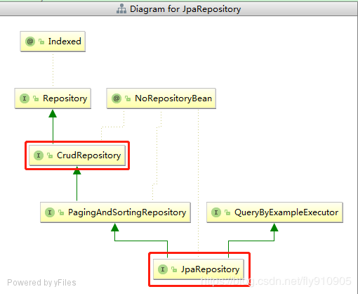

# Jpa查询

## 1.JpaRepository简单查询

基本查询也分为两种，一种是spring data默认已经实现，一种是根据查询的方法来自动解析成SQL。

### 预先生成方法

> spring data jpa 默认预先生成了一些基本的CURD的方法，例如：增、删、改等等
>
> 继承JpaRepository
>

```java
public interface UserRepository extends JpaRepository<User, Long> {
}
```

### 使用默认方法

```java
@Test
public void testBaseQuery() throws Exception {
    User user=new User();
    userRepository.findAll();
    userRepository.findOne(1l);
    userRepository.save(user);
    userRepository.delete(user);
    userRepository.count();
    userRepository.exists(1l);
    // ...
}
```

- 自定义的简单查询就是根据方法名来自动生成SQL，主要的语法是findXXBy,readAXXBy,queryXXBy,countXXBy, getXXBy后面跟属性名称：
- 具体的关键字，使用方法和生产成SQL如下表所示

| Keyword       | Sample                              | JPQL snippet                                             |
| ----------------- | --------------------------------------- | ------------------------------------------------------------ |
| And               | findByLastnameAndFirstname              | … where x.lastname = ?1 and x.firstname = ?2                 |
| Or                | findByLastnameOrFirstname               | … where x.lastname = ?1 or x.firstname = ?2                  |
| Is,Equals         | findByFirstnameIs,findByFirstnameEquals | … where x.firstname = ?1                                     |
| Between           | findByStartDateBetween                  | … where x.startDate between ?1 and ?2                        |
| LessThan          | findByAgeLessThan                       | … where x.age < ?1                                           |
| LessThanEqual     | findByAgeLessThanEqual                  | … where x.age ⇐ ?1                                           |
| GreaterThan       | findByAgeGreaterThan                    | … where x.age > ?1                                           |
| GreaterThanEqual  | findByAgeGreaterThanEqual               | … where x.age >= ?1                                          |
| After             | findByStartDateAfter                    | … where x.startDate > ?1                                     |
| Before            | findByStartDateBefore                   | … where x.startDate < ?1                                     |
| IsNull            | findByAgeIsNull                         | … where x.age is null                                        |
| IsNotNull,NotNull | findByAge(Is)NotNull                    | … where x.age not null                                       |
| Like              | findByFirstnameLike                     | … where x.firstname like ?1                                  |
| NotLike           | findByFirstnameNotLike                  | … where x.firstname not like ?1                              |
| StartingWith      | findByFirstnameStartingWith             | … where x.firstname like ?1 (parameter bound with appended %) |
| EndingWith        | findByFirstnameEndingWith               | … where x.firstname like ?1 (parameter bound with prepended %) |
| Containing        | findByFirstnameContaining               | … where x.firstname like ?1 (parameter bound wrapped in %)   |
| OrderBy           | findByAgeOrderByLastnameDesc            | … where x.age = ?1 order by x.lastname desc                  |
| Not               | findByLastnameNot                       | … where x.lastname <> ?1                                     |
| In                | findByAgeIn(Collection ages)            | … where x.age in ?1                                          |
| NotIn             | findByAgeNotIn(Collection age)          | … where x.age not in ?1                                      |
| TRUE          | findByActiveTrue()                      | … where x.active = true                                      |
| FALSE         | findByActiveFalse()                     | … where x.active = false                                     |
| IgnoreCase        | findByFirstnameIgnoreCase               | … where UPPER(x.firstame) = UPPER(?1)                        |

> 按照SpringData的规范，查询方法以find | read | get 开头，涉及查询条件时，条件的属性用条件关键字连接，
>
> 要注意的是：条件属性以首字母大写。
>

- 示例：

例如：定义一个Entity实体类：

```java
class People{
       private String firstName;
       private String lastName;
}
```

> 以上使用and条件查询时，应这样写：
>
> `findByLastNameAndFirstName(String lastName,String firstName);`
>
> 注意：条件的属性名称与个数要与参数的位置与个数一一对应
>

## 2.JpaRepository查询方法解析流程

### JPA方法名解析流程

- SpringData JPA框架在进行方法名解析时，会先把方法名多余的前缀截取掉
- 比如find、findBy、read、readBy、get、getBy，然后对剩下部分进行解析。
- 假如创建如下的查询：findByUserDepUuid()，框架在解析该方法时，首先剔除findBy，然后对剩下的属性进行解析，假设查询实体为Doc。

> -- 1.先判断userDepUuid (根据POJO（PlainOrdinaryJavaObject简单java对象，实际就是普通java bean）规范，首字母变为小写。)是否是查询实体的一个属性，
>
> 如果根据该属性进行查询；如果没有该属性，继续第二步。
>
> -- 2.从右往左截取第一个大写字母开头的字符串(此处为Uuid)，然后检查剩下的字符串是否为查询实体的一个属性，
>
> 如果是，则表示根据该属性进行查询；如果没有该属性，则重复第二步，继续从右往左截取；最后假设 user为查询实体的一个属性。
>
> -- 3.接着处理剩下部分（DepUuid），先判断 user 所对应的类型是否有depUuid属性，
>
> 如果有，则表示该方法最终是根据“Doc.user.depUuid”的取值进行查询；
>
> 否则继续按照步骤2的规则从右往左截取，最终表示根据“Doc.user.dep.uuid”的值进行查询。
>
> -- 4.可能会存在一种特殊情况，比如Doc包含一个 user 的属性，也有一个 userDep 属性，此时会存在混淆。
>
> 可以明确在属性之间加上"_"以显式表达意图，比如"findByUser_DepUuid()"或者"findByUserDep_uuid()"。
>

### 特殊的参数（分页或排序）：

- 还可以直接在方法的参数上加入分页或排序的参数，比如：

```java
Page findByName(Stringname, Pageable pageable);
List findByName(Stringname, Sort sort);
```

- Pageable 是spring封装的分页实现类，使用的时候需要传入页数、每页条数和排序规则

```java
@Test
public void testPageQuery() throws Exception {
    int page=1,size=10;
    Sort sort = new Sort(Direction.DESC, "id");
    Pageable pageable = new PageRequest(page, size, sort);
    userRepository.findALL(pageable);
    userRepository.findByUserName("testName", pageable);
}
```

### 使用JPA的NamedQueries

- 方法如下：

1. 在实体类上使用@NamedQuery，示例如下：

@NamedQuery(name = "UserModel.findByAge",query = "select o from UserModel o where o.age >= ?1")

2. 在自己实现的DAO的Repository接口里面定义一个同名的方法，示例如下：

public List findByAge(int age);

3. 然后就可以使用了，Spring会先找是否有同名的NamedQuery，如果有，那么就不会按照接口定义的方法来解析。

### 使用@Query来指定本地查询

只要设置nativeQuery为true

- 比如：

```java
@Query(value="select * from tbl_user where name like %?1" ,nativeQuery=true)
public List<UserModel> findByUuidOrAge(String name);
```

> 注意：当前版本的本地查询不支持翻页和动态的排序
>

### 使用命名化参数

使用@Param即可

比如：

```java
@Query(value="select o from UserModel o where o.name like %:nn")
public List<UserModel> findByUuidOrAge(@Param("nn") String name);
```

### 创建查询的顺序

- Spring Data JPA 在为接口创建代理对象时，如果发现同时存在多种上述情况可用，它该优先采用哪种策略呢？

提供了`query-lookup-strategy `属性，用以指定查找的顺序。它有如下三个取值：

1. create-if-not-found：

   如果方法通过@Query指定了查询语句，则使用该语句实现查询；

   如果没有，则查找是否定义了符合条件的命名查询，如果找到，则使用该命名查询；

   如果两者都没有找到，则通过解析方法名字来创建查询。

   这是querylookup-strategy 属性的默认值

2. create：通过解析方法名字来创建查询。

   即使有符合的命名查询，或者方法通过@Query指定的查询语句，都将会被忽略

3. use-declared-query：

   如果方法通过@Query指定了查询语句，则使用该语句实现查询；

   如果没有，则查找是否定义了符合条件的命名查询，如果找到，则使用该命名查询；如果两者都没有找到，则抛出异常

## 3.JpaRepository限制查询

- 有时候我们只需要查询前N个元素，或者支取前一个实体。

```java
User findFirstByOrderByLastnameAsc();
User findTopByOrderByAgeDesc();
Page<User> queryFirst10ByLastname(String lastname, Pageable pageable);
List<User> findFirst10ByLastname(String lastname, Sort sort);
List<User> findTop10ByLastname(String lastname, Pageable pageable);
```

## 4.JpaRepository多表查询

- 多表查询在spring data jpa中有两种实现方式，第一种是利用hibernate的级联查询来实现，第二种是创建一个结果集的接口来接收连表查询后的结果，这里主要第二种方式。
- 首先需要定义一个结果集的接口类。

```java
public interface HotelSummary {
    City getCity();
    String getName();
    Double getAverageRating();
    default Integer getAverageRatingRounded() {
        return getAverageRating() == null ? null : (int) Math.round(getAverageRating());
    }
}
```

- 查询的方法返回类型设置为新创建的接口

```java
@Query("select h.city as city, h.name as name, avg(r.rating) as averageRating "
        + "from Hotel h left outer join h.reviews r where h.city = ?1 group by h")
Page<HotelSummary> findByCity(City city, Pageable pageable);
 
 
@Query("select h.name as name, avg(r.rating) as averageRating "
        + "from Hotel h left outer join h.reviews r  group by h")
Page<HotelSummary> findByCity(Pageable pageable);
```

- 使用

```
Page<HotelSummary> hotels = this.hotelRepository.findByCity(new PageRequest(0, 10, Direction.ASC, "name"));
for(HotelSummary summay:hotels){
        System.out.println("Name" +summay.getName());
    }
```

> 在运行中Spring会给接口（HotelSummary）自动生产一个代理类来接收返回的结果，代码汇总使用getXX的形式来获取
>

# JPA更新

## 支持更新类的Query语句

添加@Modifying即可

- 比如：

```java
@Modifying
@Query(value="update UserModel o set o.name=:newName where o.name like %:nn")
public int findByUuidOrAge(@Param("nn") String name,@Param("newName") String newName);
```

> 注意：
>
> 1：方法的返回值应该是int，表示更新语句所影响的行数
>
> 2：在调用的地方必须加事务，没有事务不能正常执行

# JPA删除

## SQL方式-删除

```java
@Query(value = "delete from r_upa where user_id= ?1 and point_indecs_id in (?2)", nativeQuery = true)
@Modifying
void deleteByUserAndPointIndecs(Long uid, List<Long> hids);
```
> 注意：
>
> 执行delete和update语句一样，需要添加@Modifying注解，使用时在Repository或者更上层需要@Transactional注解。

## 函数（delete）方式-删除

- 直接可以使用delete(id),依据id来删除一条数据
- 也可以使用deleteByName(String name)时，需要添加@Transactional注解，才能使用
- Spring Data JPA的deleteByXXXX，是先select，在整个Transaction完了之后才执行delete



###  JpaRepository

```java
@NoRepositoryBean
public interface JpaRepository<T, ID> extends PagingAndSortingRepository<T, ID>, QueryByExampleExecutor<T> {
    
    /**
	 * Deletes the given entities in a batch which means it will create a single {@link Query}. Assume that we will clear
	 * the {@link javax.persistence.EntityManager} after the call.
	 *
	 * @param entities
     * 批量解绑多个，优势：只会形成一个SQL语句
	 */
	void deleteInBatch(Iterable<T> entities);
 
	/**
	 * Deletes all entities in a batch call.
	 */
	void deleteAllInBatch();
 
   
}
```

### CrudRepository

```java
@NoRepositoryBean
public interface CrudRepository<T, ID> extends Repository<T, ID> {
   
    /**
	 * Deletes the entity with the given id.
	 *
	 * @param id must not be {@literal null}.
	 * @throws IllegalArgumentException in case the given {@code id} is {@literal null}
	 */
	void deleteById(ID id);
 
	/**
	 * Deletes a given entity.
	 *
	 * @param entity
	 * @throws IllegalArgumentException in case the given entity is {@literal null}.
	 */
	void delete(T entity);
 
	/**
	 * Deletes the given entities.
	 *
	 * @param entities
	 * @throws IllegalArgumentException in case the given {@link Iterable} is {@literal null}.
	 */
	void deleteAll(Iterable<? extends T> entities);
 
	/**
	 * Deletes all entities managed by the repository.
	 */
	void deleteAll();
}
```

# JPA添加

利用JpaRepository和CrudRepository中的 save操作

## JpaRepository

```java
@NoRepositoryBean
public interface JpaRepository<T, ID> extends PagingAndSortingRepository<T, ID>, QueryByExampleExecutor<T> {
 
	
	/*
	 * (non-Javadoc)
	 * @see org.springframework.data.repository.CrudRepository#save(java.lang.Iterable)
	 */
	<S extends T> List<S> saveAll(Iterable<S> entities);
 
	/**
	 * Flushes all pending changes to the database.
	 */
	void flush();
 
	/**
	 * Saves an entity and flushes changes instantly.
	 *
	 * @param entity
	 * @return the saved entity
	 */
	<S extends T> S saveAndFlush(S entity);
 
	
}
```

## CrudRepository

```
@NoRepositoryBean
public interface CrudRepository<T, ID> extends Repository<T, ID> {
 
	/**
	 * Saves a given entity. Use the returned instance for further operations as the save operation might have changed the
	 * entity instance completely.
	 *
	 * @param entity must not be {@literal null}.
	 * @return the saved entity will never be {@literal null}.
	 */
	<S extends T> S save(S entity);
 
	/**
	 * Saves all given entities.
	 *
	 * @param entities must not be {@literal null}.
	 * @return the saved entities will never be {@literal null}.
	 * @throws IllegalArgumentException in case the given entity is {@literal null}.
	 */
	<S extends T> Iterable<S> saveAll(Iterable<S> entities);
}
```

## JpaRepository和CrudRepository 的区别

-  JpaRepository 中的save方法实现源码：

```java
  @Transactional
    public <S extends T> List<S> save(Iterable<S> entities) {
        List<S> result = new ArrayList<S>();
        if (entities == null) {
            return result;
        }
        for (S entity : entities) {
            result.add(save(entity));
        }
        return result;
    }
```

- CrudRepository 中的save方法源代码

```java
@Transactional
    public <S extends T> S save(S entity) {
        if (entityInformation.isNew(entity)) {
            em.persist(entity);//是新的就插入
            return entity;
        } else {
            return em.merge(entity); //不是新的merge
        }
    }
```

由源码可知**CrudRepository 中的save方法是相当于merge+save ，它会先判断记录是否存在，如果存在则更新，不存在则插入记录**

