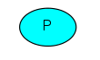
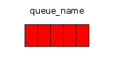
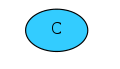

## RabbitMQ 消息队列简介

RabbitMQ 是高级消息队列协议（AMQP）的开源消息代理软件。RabbitMQ 服务器是用 Erlang 语言编写的，消息系统允许软件、应用相互连接和扩展．这些应用可以相互链接起来组成一个更大的应用， 或者将用户设备和数据进行连接．消息系统通过将消息的发送和接收分离来实现应用程序的异 步和解偶． 或许你正在考虑进行数据投递，非阻塞操作或推送通知。或许你想要实现发布／订阅，异步处理， 或者工作队列。所有这些都可以通过消息实现。 RabbitMQ 是一个消息代理 - 一个消息系统的媒介。它可以为你的应用提供一个通用的消息发 送和接收平台，并且保证消息在传输过程中的安全。

**功能亮点：**

- 可靠性：RabbitMQ 提供了各种功能，让你权衡性能与可靠性，其中包括持久性，交付确认和高可用性。
- 灵活的路由：消息在到达队列之前，通过交换机的路由。RabbitMQ 为典型的路由逻辑提供了几个内置的交换机类型。对于更复杂的路由，则可以绑定几种交换机一起使用甚至可以自己实现交换机类型，并且把它作为一个插件的来使用。
- 集群：在本地网络上的几个 RabbitMQ 服务器可以聚集在一起，作为一个独立的逻辑代理来使用。
- 联合：对于服务器来说，它比集群需要更多的松散和非可靠链接。为此 RabbitMQ 提供了联合模型。
- 高度可用队列：在群集中，队列可以被镜像到几个机器中，确保您的消息即使在出现硬件故障的安全。
- 多协议：RabbitMQ 支持上各种消息传递协议的消息传送.
- 许多客户端：有你能想到的几乎任何语言 RabbitMQ 客户端。
- 管理用户界面：RabbitMQ 附带一个简单使用管理用户界面，允许您监视和控制您的消息代理的各个方面。
- 追踪：如果您的消息系统行为异常，RabbitMQ 提供跟踪支持，让你找出问题是什么。
- 插件系统：RabbitMQ 附带各种插件扩展，并且你也可以写你自己插件.
- 商业支持:提供商业支持、 培训和咨询。
- 大型社区:有一个庞大的社区 RabbitMQ，有各种各样的客户端、 插件、 指南等。

## 支持的平台及语言

RabbitMQ有着运行在所有 Erlang 所支持的平台之上的潜力，从嵌入式系统到多核心集群还有基于云端的服务器。

> 以下的平台是 Erlang 语言所支持的，因此RabbitMQ可以运行其上：

- Solaris
- BSD
- Linux
- MacOSX
- TRU64
- Windows NT/2000/XP/Vista/Windows 7/Windows 8
- Windows Server 2003/2008/2012
- Windows 95, 98
- VxWorks

> RabbitMQ 的开源版本通常被部署在以下的平台上：

- Ubuntu 和其他基于 Debian 的 Linux 发行版
- Fedora 和其他基于 RPM 包管理方式的 Linux 发行版
- openSUSE 和衍生的发行版（包括 SLES 和 SLERT）
- Mac OS X
- Windows XP 和 后续版本

> RabbitMQ 支持下列编程语言：

- C# (using .net/c# client)
- clojure (using Langohr)
- erlang (using erlang client)
- java (using java client)
- javascript/node.js (using amqp.node)
- perl (using Net::RabbitFoot)
- python (using pika)
- python-puka (using puka)
- ruby (using Bunny)
- ruby (using amqp gem)

## 原理介绍

RabbitMQ 是一个消息代理。它的核心原理非常简单：接收和发送消息。你可以把它想像成一个邮局：你把信件放入邮箱，邮递员就会把信件投递到你的收件人处。在这个比喻中，RabbitMQ就扮演着邮箱、邮局以及邮递员的角色。

RabbitMQ 和邮局的主要区别是，它不是用来处理纸张的，它是用来接收、存储和发送消息（message）这种二进制数据的。

在这里我们使用生产者、消费者模型来进行此次的模拟。

> 生产者消费者问题（英语：Producer-consumer problem），也称有限缓冲问题（英语：Bounded-buffer problem），是一个多线程同步问题的经典案例。该问题描述了两个共享固定大小缓冲区的线程——即所谓的“生产者”和“消费者”——在实际运行时会发生的问题。生产者的主要作用是生成一定量的数据放到缓冲区中，然后重复此过程。与此同时，消费者也在缓冲区消耗这些数据。该问题的关键就是要保证生产者不会在缓冲区满时加入数据，消费者也不会在缓冲区中空时消耗数据。

- 生产者(Producer)：生成一定量的数据放到缓冲区中的程序统称，产生消息并发送到消息队列中的程序就是一个[生产者](https://zh.wikipedia.org/wiki/生产者消费者问题)(producer)。也是我们上文比喻中写信，投信的人，我们一般用 “P” 来表示:

- 队列(queue)是一种特殊的线性表，在本实验环境中用于存放消息，也就是上文比喻中的邮箱。消息通过你的应用程序和RabbitMQ进行传输，它们能够只存储在一个队列（queue）中。 队列（queue）没有任何限制，你要存储多少消息都可以——基本上是一个无限的缓冲。多个生产者（producers）能够把消息发送给同一个队列，同样，多个消费者（consumers）也能够从同一个队列（queue）中获取数据。队列可以绘制成这样（图上是队列的名称）：

- 消费者（Consumer）便是从消息队列中取出数据的程序统称。也就是上文比喻中的收件人，[消费者](http://blog.csdn.net/morewindows/article/details/7577591)（consumer）就是一个等待获取消息的程序。我们把它绘制为 "C"：

需要指出的是生产者、消费者、代理一般不会放置在在同一个设备上；事实上大多数应用也确实不在会将他们放在一台机器上。