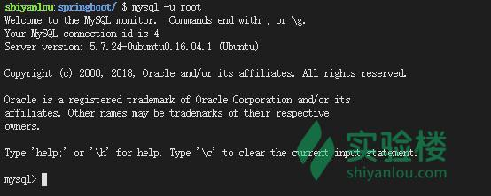
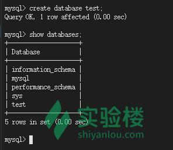
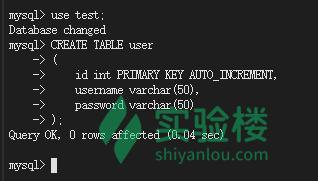
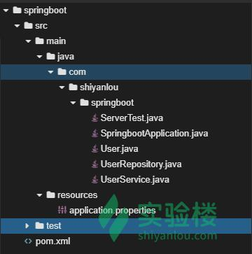
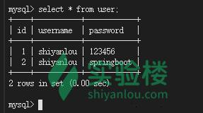

##  什么是数据库事务

数据库事务(Database Transaction) ，是指作为单个逻辑工作单元执行的一系列操作，要么完全地执行，要么完全地不执行。 事务处理可以确保除非事务性单元内的所有操作都成功完成，否则不会永久更新面向数据的资源。通过将一组相关操作组合为一个要么全部成功要么全部失败的单元，可以简化错误恢复并使应用程序更加可靠。一个逻辑工作单元要成为事务，必须满足所谓的 ACID（原子性、一致性、隔离性和持久性）属性。事务是数据库运行中的逻辑工作单位，由 DBMS 中的事务管理子系统负责事务的处理。

## 数据库事务的特性

- 原子性：一个事务（transaction）中的所有操作，要么全部完成，要么全部不完成，不会结束在中间某个环节。事务在执行过程中发生错误，会被恢复（Rollback）到事务开始前的状态，就像这个事务从来没有执行过一样。

- 一致性：在事务开始之前和事务结束以后，数据库的完整性没有被破坏。这表示写入的资料必须完全符合所有的预设规则，这包含资料的精确度、串联性以及后续数据库可以自发性地完成预定的工作。
- 隔离性：数据库允许多个并发事务同时对其数据进行读写和修改的能力，隔离性可以防止多个事务并发执行时由于交叉执行而导致数据的不一致。事务隔离分为不同级别，包括读未提交（Read uncommitted）、读提交（read committed）、可重复读（repeatable read）和串行化（Serializable）。
- 持久性：事务处理结束后，对数据的修改就是永久的，即便系统故障也不会丢失。

## 事务的隔离级别

在数据库事务的 ACID 四个属性中，隔离性是一个最常放松的一个。为了获取更高的隔离等级，数据库系统的锁机制或者多版本并发控制机制都会影响并发。 应用软件也需要额外的逻辑来使其正常工作。
很多数据库管理系统定义了不同的“事务隔离等级”来控制锁的程度。在很多数据库系统中，多数的数据库事务都避免高等级的隔离等级（如可序列化）从而减少对系统的锁定开销。程序员需要小心的分析数据库访问部分的代码来保证隔离级别的降低不会造成难以发现的代码 bug。相反的，更高的隔离级别会增加死锁发生的几率，同样需要编程过程中去避免。
ANSI/ISO SQL 定义的标准隔离级别如下：

**可串行化**

最高的隔离级别。
在基于锁机制并发控制的 DBMS 实现可串行化，要求在选定对象上的读锁和写锁保持直到事务结束后才能释放。在 SELECT 的查询中使用一个“WHERE”子句来描述一个范围时应该获得一个“范围锁”（range-locks）。这种机制可以避免“幻影读”（phantom reads）现象（详见下文）。
当采用不基于锁的并发控制时不用获取锁。但当系统探测到几个并发事务有“写冲突”的时候，只有其中一个是允许提交的。这种机制的详细描述见“快照隔离”

**可重复读**

在可重复读（REPEATABLE READS）隔离级别中，基于锁机制并发控制的 DBMS 需要对选定对象的读锁（read locks）和写锁（write locks）一直保持到事务结束，但不要求“范围锁”，因此可能会发生“幻影读”。

**提交读**

在提交读（READ COMMITTED）级别中，基于锁机制并发控制的 DBMS 需要对选定对象的写锁一直保持到事务结束，但是读锁在 SELECT 操作完成后马上释放（因此“不可重复读”现象可能会发生，见下面描述）。和前一种隔离级别一样，也不要求“范围锁”。

**未提交读**

未提交读（READ UNCOMMITTED）是最低的隔离级别。允许“脏读”（dirty reads），事务可以看到其他事务“尚未提交”的修改。

- 脏读：一个事务读取到了另一个事务没有提交的事务
- 不可重复读：一个事务中对同一行记录读取两次得到不同的结果
- 幻影读：一个事务两个相同的查询获得的结果不相同

**不可重复读和幻影读的区别主要在于不可重复读是由于更新和删除操作造成的，而幻影读是由于插入操作造成的。**

## Sprng Boot 事务控制

在 Spring 中，要进行事务管理有两种方式，一种是编程式事务，一种是声明式事务，但是都需要配置事务管理器，想要了解的同学可以去查看 Spring 的事务管理，而 SpringBoot 的事务管理十分简单，只需要一个@Transactional 注解就可以了，当然必须是使用主流 ORM 框架。下面看看如何使用 SpringBoot 进行事务控制，这里采用 Spring-Date-JPA 来演示，Spring-Data-JPA 比较简单，学过 Hibernate 的同学都可以很快的上手，没有学过的同学也没有关系，这里的应用比较简单。

### 初始化数据库

先建立一个测试数据库，首先打开终端，然后需要启动 mysql 服务

```shell
sudo service mysql start
```


接着进入数据库

```shell
mysql -u root
```



创建数据库`test`,并且查看数据库是否创建成功。

```mysql
create database test;
show databases;
```



切换到数据库`test`,创建数据表`user`;

```mysql
use test;
CREATE TABLE user
(
    id int PRIMARY KEY AUTO_INCREMENT,
    username varchar(50),
    password varchar(50)
);
```



### 创建 SpringBoot 项目

首先需要创建一个 SpringBoot 项目`springboot`，接着创建包`com.shiyanlou.springboot`，最后形成下面的目录结构：



接着修改 pom.xml，

```xml
<?xml version="1.0" encoding="UTF-8"?>
<project xmlns="http://maven.apache.org/POM/4.0.0" xmlns:xsi="http://www.w3.org/2001/XMLSchema-instance"
    xsi:schemaLocation="http://maven.apache.org/POM/4.0.0 http://maven.apache.org/xsd/maven-4.0.0.xsd">
    <modelVersion>4.0.0</modelVersion>

    <groupId>com.shiyanlou</groupId>
    <artifactId>springboot</artifactId>
    <version>0.0.1-SNAPSHOT</version>
    <packaging>jar</packaging>

    <name>springboot</name>
    <description>Demo project for Spring Boot</description>

    <!--设置父模块 这样就可以继承父模块中的配置信息-->
    <parent>
        <groupId>org.springframework.boot</groupId>
        <artifactId>spring-boot-starter-parent</artifactId>
        <version>2.0.4.RELEASE</version>
        <relativePath/>
    </parent>

    <properties>
        <project.build.sourceEncoding>UTF-8</project.build.sourceEncoding>
        <project.reporting.outputEncoding>UTF-8</project.reporting.outputEncoding>
        <java.version>1.8</java.version>
    </properties>

    <dependencies>
        <dependency>
            <groupId>org.springframework.boot</groupId>
            <artifactId>spring-boot-starter-data-jpa</artifactId>
        </dependency>
        <dependency>
            <groupId>mysql</groupId>
            <artifactId>mysql-connector-java</artifactId>
            </dependency>
    </dependencies>

    <build>
        <plugins>
        <!--spirng Boot maven插件-->
            <plugin>
                <groupId>org.springframework.boot</groupId>
                <artifactId>spring-boot-maven-plugin</artifactId>
            </plugin>
        </plugins>
    </build>

</project>
```

### User.java

创建实体类 User.java

```java
package com.shiyanlou.springboot;

import javax.persistence.*;

/**
 * 设置表名为user，并且标记该类为实体类
 */
@Table(name = "user")
@Entity
public class User {

    /**
     * 设置主键生成策略
     */
    @GeneratedValue(strategy = GenerationType.IDENTITY)
    @Id
    public int id;

    @Column
    private String username;

    @Column
    private String password;

    public int getId() {
        return id;
    }

    public void setId(int id) {
        this.id = id;
    }

    public String getUsername() {
        return username;
    }

    public void setUsername(String username) {
        this.username = username;
    }

    public String getPassword() {
        return password;
    }

    public void setPassword(String password) {
        this.password = password;
    }

    @Override
    public String toString() {
        return "User{" +
                "id=" + id +
                ", username='" + username + '\'' +
                ", password='" + password + '\'' +
                '}';
    }
}
```

### UserRepository.java

UserRepository.java 作为 dao 层

```java
package com.shiyanlou.springboot;

import org.springframework.data.repository.CrudRepository;

/**
 * 继承CrudRepository
 */
public interface UserRepository extends CrudRepository<User, Integer> {

}
```

### UserService.java

UserService.java 作为 service 层
UserService 层的作用是保存传递过来的 User 对象，接着将保存后的 User 对象的密码修改成`123456`

```java
package com.shiyanlou.springboot;

import org.springframework.beans.factory.annotation.Autowired;
import org.springframework.stereotype.Service;


@Service
public class UserService {

    @Autowired
    private UserRepository userRepository;

    public User save(User user) {
//        保存实体类
        userRepository.save(user);
        //修改密码
        user.setPassword("123456");
        //重新保存，更新记录
        return userRepository.save(user);
    }


}
```

### SpringbootApplication.java

用于启动 Spring Boot 程序

```java
package com.shiyanlou.springboot;

import org.springframework.boot.SpringApplication;
import org.springframework.boot.autoconfigure.SpringBootApplication;

@SpringBootApplication
public class SpringbootApplication {

    public static void main(String[] args) {
        SpringApplication.run(SpringbootApplication.class, args);
    }
}
```

### ServerTest.java

```java
package com.shiyanlou.springboot;

import org.springframework.beans.factory.annotation.Autowired;
import org.springframework.boot.ApplicationArguments;
import org.springframework.boot.ApplicationRunner;
import org.springframework.stereotype.Component;

/**
 * ApplicationRunner接口可以让在SpringBoot启动后马上执行想要执行的方法
 */
@Component
public class ServerTest implements ApplicationRunner {

    /**
     * 注入userService服务
     */
    @Autowired
    public UserService userService;

    /**
     * 该方法再SpringBoot启动完成后立即执行
     *
     * @param args
     * @throws Exception
     */
    @Override
    public void run(ApplicationArguments args) {
//        新建一个实体类
        User user = new User();
        user.setPassword("springboot");
        user.setUsername("shiyanlou");
//        调用包存实体类的service
        userService.save(user);
    }
}
```

### application.properties

```properties
spring.datasource.url=jdbc:mysql://localhost:3306/test
spring.datasource.username=root
spring.datasource.password=
spring.datasource.driver-class-name=com.mysql.jdbc.Driver
```

### 测试 SpringBoot 事务管理

启动 SpringBoot 项目`mvn spring-boot:run`，等待项目运行完成，看下数据库记录

```mysql
select * from user;
```


成功保存记录并且修改密码为 123456，现在在 service 中人为抛出一个异常，修改 UserService.java。

```java
package com.shiyanlou.springboot;

import org.springframework.beans.factory.annotation.Autowired;
import org.springframework.stereotype.Service;


@Service
public class UserService {

    @Autowired
    private UserRepository userRepository;

    public User save(User user) {
//        保存实体类
        userRepository.save(user);
//        人为抛出异常
        int shiyanlou = 1 / 0;
        //修改密码
        user.setPassword("123456");
        //重新保存，更新记录
        return userRepository.save(user);
    }


}
```

再查看一下数据库记录



可以看到数据库中的数据并不是想要的，因为异常的发生，导致数据库数据出现了错误，最后修改密码的方法没有运行，密码依旧为 spingboot，将异常处理加上看看还会不会出现这种情况。

在 UserService.java 的 save 方法上加上@Transactional 注解

@Transactional 属性如下：

| 属性                   | 类型                              | 描述                                          |
| ---------------------- | --------------------------------- | --------------------------------------------- |
| value                  | String                            | 设置事务管理器(可选)                          |
| transactionManager     | String                            | 设置事务管理器(可选)                          |
| propagation            | enum: Propagation                 | 事务传播行为 (可选)                           |
| isolation              | enum: Isolation                   | 事务隔离级别 (可选)                           |
| timeout                | int                               | 事务超时时间 (可选)                           |
| readOnly               | boolean                           | 是否只读事务，默认 false，即为读写事务 (可选) |
| rollbackFor            | Class 对象数组，继承自 Throwable  | 导致事务回滚的异常类数组 (可选)               |
| rollbackForClassName   | 类名数组，继承自 Throwable 的类名 | 导致事务回滚的异常类名字数组 (可选)           |
| noRollbackFor          | Class 对象数组，继承自 Throwable  | 不会导致事务回滚的异常类数组 (可选)           |
| noRollbackForClassName | 类名数组，继承自 Throwable 的类名 | 不会导致事务回滚的异常类名字数组(可选)        |

修改 userService.java

```java
package com.shiyanlou.springboot;

import org.springframework.beans.factory.annotation.Autowired;
import org.springframework.stereotype.Service;
import org.springframework.transaction.annotation.Transactional;


@Service
public class UserService {

    @Autowired
    private UserRepository userRepository;

    /**
     * 添加事务管理
     */
    @Transactional(rollbackFor = Exception.class)
    public User save(User user) {
//        保存实体类
        userRepository.save(user);
//        人为抛出异常
        int shiyanlou = 1 / 0;
        //修改密码
        user.setPassword("123456");
        //重新保存，更新记录
        return userRepository.save(user);
    }


}
```

再次启动程序，查看数据库记录


可以看到数据库并没有插入数据，是因为添加了事务管理，在发生异常后进行了回滚，新的记录被撤销了。