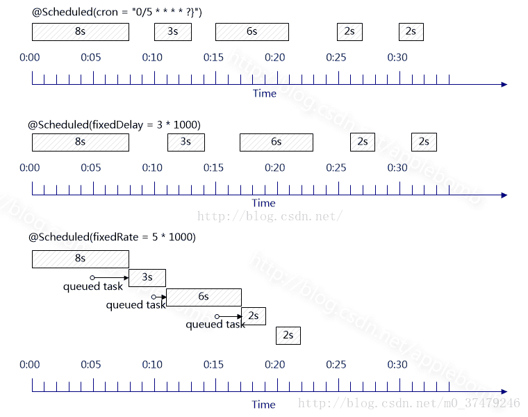

# Spring Boot中使用@Scheduled创建定时任务

我们在编写Spring Boot应用中经常会遇到这样的场景，比如：我需要定时地发送一些短信、邮件之类的操作，也可能会定时地检查和监控一些标志、参数等。

## 创建定时任务

在Spring Boot中编写定时任务是非常简单的事，下面通过实例介绍如何在Spring Boot中创建定时任务，实现每过5秒输出一下当前时间。

- 在Spring Boot的主类中加入`@EnableScheduling`注解，启用定时任务的配置

```java
@SpringBootApplication
@EnableScheduling
public class Application {
    public static void main(String[] args) {
        SpringApplication.run(Application.class, args);
    }
}
```

- 创建定时任务实现类

```java
@Component
public class ScheduledTasks {
    private static final SimpleDateFormat dateFormat = new SimpleDateFormat("HH:mm:ss");
    @Scheduled(fixedRate = 5000)
    public void reportCurrentTime() {
        System.out.println("现在时间：" + dateFormat.format(new Date()));
    }
}
```


- 运行程序，控制台中可以看到类似如下输出，定时任务开始正常运作了。

```
2016-05-15 10:40:04.073  INFO 1688 --- [           main] com.didispace.Application                : Started Application in 1.433 seconds (JVM running for 1.967)
现在时间：10:40:09
现在时间：10:40:14
现在时间：10:40:19
现在时间：10:40:24
现在时间：10:40:29522
现在时间：10:40:34
```

## @Scheduled详解

在上面的入门例子中，使用了`@Scheduled(fixedRate = 5000)` 注解来定义每过5秒执行的任务，对于`@Scheduled`的使用可以总结如下几种方式：

- `@Scheduled(fixedRate = 5000)` ：上一次开始执行时间点之后5秒再执行
- `@Scheduled(fixedDelay = 5000)` ：上一次执行完毕时间点之后5秒再执行
- `@Scheduled(initialDelay=1000, fixedRate=5000)` ：第一次延迟1秒后执行，之后按fixedRate的规则每5秒执行一次
- `@Scheduled(cron="*/5 * * * * *")` ：通过cron表达式定义规则

## @Scheduled中fixedDelay、fixedRate、initialDelay 和cron表达式的解析及区别

### 在线Cron表达式生成器

http://cron.qqe2.com/

### 介绍

cronExpression定义时间规则，Cron表达式由6或7个空格分隔的时间字段组成：秒 分钟 小时 日期 月份 星期 年（可选）；

|字段　|　允许值　|　允许的特殊字符|
|---|---|---|
|秒 　| 0-59 　|　　　, - * /|
|分 　| 0-59　　|　　 , - * /|
|小时| 0-23 　　|　　, - * /|
|日期 |1-31 　　　|　, - * ? / L W C|
|月份 |1-12 　　　|　, - * /|
|星期| 1-7 　　　　| , - * ? / L C #|
|年 |1970-2099 　|　, - * /|

解析：
`0/5 * * * * ? `： 每5秒执行一次

“”字符被用来指定所有的值。如：""在分钟的字段域里表示“每分钟”。
“?”字符只在日期域和星期域中使用。它被用来指定“非明确的值”。当你需要通过在这两个域中的一个来指定一些东西的时候，它是有用的。看下面的例子你就会明白。
月份中的日期和星期中的日期这两个元素时互斥的一起应该通过设置一个问号来表明不想设置那个字段。

“-”字符被用来指定一个范围。如：“10-12”在小时域意味着“10点、11点、12点”。

“,”字符被用来指定另外的值。如：“MON,WED,FRI”在星期域里表示”星期一、星期三、星期五”。

“/”字符用于指定增量。如：“0/15”在秒域意思是每分钟的0，15，30和45秒。“5/15”在分钟域表示每小时的5，20，35和50。 符号“”在“/”前面（如：/10）等价于0在“/”前面（如：0/10）。记住一条本质：表达式的每个数值域都是一个有最大值和最小值的集合，如： 秒域和分钟域的集合是0-59，日期域是1-31，月份域是1-12。字符“/”可以帮助你在每个字符域中取相应的数值。如：“7/6”在月份域的时候只 有当7月的时候才会触发，并不是表示每个6月。

L是‘last’的省略写法可以表示day-of-month和day-of-week域，但在两个字段中的意思不同，例如day-of- month域中表示一个月的最后一天。如果在day-of-week域表示‘7’或者‘SAT’，如果在day-of-week域中前面加上数字，它表示 一个月的最后几天，例如‘6L’就表示一个月的最后一个星期五。

字符“W”只允许日期域出现。这个字符用于指定日期的最近工作日。例如：如果你在日期域中写 “15W”，表示：这个月15号最近的工作日。所以，如果15号是周六，则任务会在14号触发。如果15好是周日，则任务会在周一也就是16号触发。如果 是在日期域填写“1W”即使1号是周六，那么任务也只会在下周一，也就是3号触发，“W”字符指定的最近工作日是不能够跨月份的。字符“W”只能配合一个 单独的数值使用，不能够是一个数字段，如：1-15W是错误的。

“L”和“W”可以在日期域中联合使用，LW表示这个月最后一周的工作日。

字符“#”只允许在星期域中出现。这个字符用于指定本月的某某天。例如：“6#3”表示本月第三周的星期五（6表示星期五，3表示第三周）。“2#1”表示本月第一周的星期一。“4#5”表示第五周的星期三。

字符“C”允许在日期域和星期域出现。这个字符依靠一个指定的“日历”。也就是说这个表达式的值依赖于相关的“日历”的计算结果，如果没有“日历” 关联，则等价于所有包含的“日历”。如：日期域是“5C”表示关联“日历”中第一天，或者这个月开始的第一天的后5天。星期域是“1C”表示关联“日历” 中第一天，或者星期的第一天的后1天，也就是周日的后一天（周一）。

例子如下：

| cronExpression | 效果 |
| ---- | ---- |
| `“**0 0 10,14,16 * * ? ”`|每天上午10点，下午2点，4点|
| `“0 0/30 9-17 * * ? ”`|朝九晚五工作时间内每半小时|
| `“0 0 12 ? * WED” `|表示每个星期三中午12点|
| `“0 0 12 * * ?” `|每天中午12点触发|
| `“0 15 10 ? * *”` |每天上午10:15触发|
| `“0 15 10 * * ?”` |每天上午10:15触发|
| `“0 15 10 * * ? *”` |每天上午10:15触发|
| `“0 15 10 * * ? 2005”` |2005年的每天上午10:15触发|
| `“0 * 14 * * ?” `|在每天下午2点到下午2:59期间的每1分钟触发|
| `“0 0/5 14 * * ?”` |在每天下午2点到下午2:55期间的每5分钟触发|
| `“0 0/5 14,18 * * ?”`| 在每天下午2点到2:55期间和下午6点到6:55期间的每5分钟触发|
| `“0 0-5 14 * * ?” `|在每天下午2点到下午2:05期间的每1分钟触发|
| `“0 10,44 14 ? 3 WED”`| 每年三月的星期三的下午2:10和2:44触发|
| `“0 15 10 ? * MON-FRI” `|周一至周五的上午10:15触发|
| `“0 15 10 15 * ?” `|每月15日上午10:15触发|
| `“0 15 10 L * ?” `|每月最后一日的上午10:15触发|
| `“0 15 10 ? * 6L”` |每月的最后一个星期五上午10:15触发|
| `“0 15 10 ? * 6L 2002-2005”` | 2002年至2005年的每月的最后一个星期五上午10:15触发|
| `“0 15 10 ? * 6#3”` | 每月的第三个星期五上午10:15触发|

### 注解参数区别

@Scheduled注解可以控制方法定时执行，其中有三个参数可选择：

1、fixedDelay控制方法执行的间隔时间，是以上一次方法执行完开始算起，如上一次方法执行阻塞住了，那么直到上一次执行完，并间隔给定的时间后，执行下一次。

2、fixedRate是按照一定的速率执行，是从上一次方法执行开始的时间算起，如果上一次方法阻塞住了，下一次也是不会执行，但是在阻塞这段时间内累计应该执行的次数，当不再阻塞时，一下子把这些全部执行掉，而后再按照固定速率继续执行。

3、cron表达式可以定制化执行任务，但是执行的方式是与fixedDelay相近的，也是会按照上一次方法结束时间开始算起。

4、initialDelay 。如： @Scheduled(initialDelay = 10000,fixedRate = 15000

