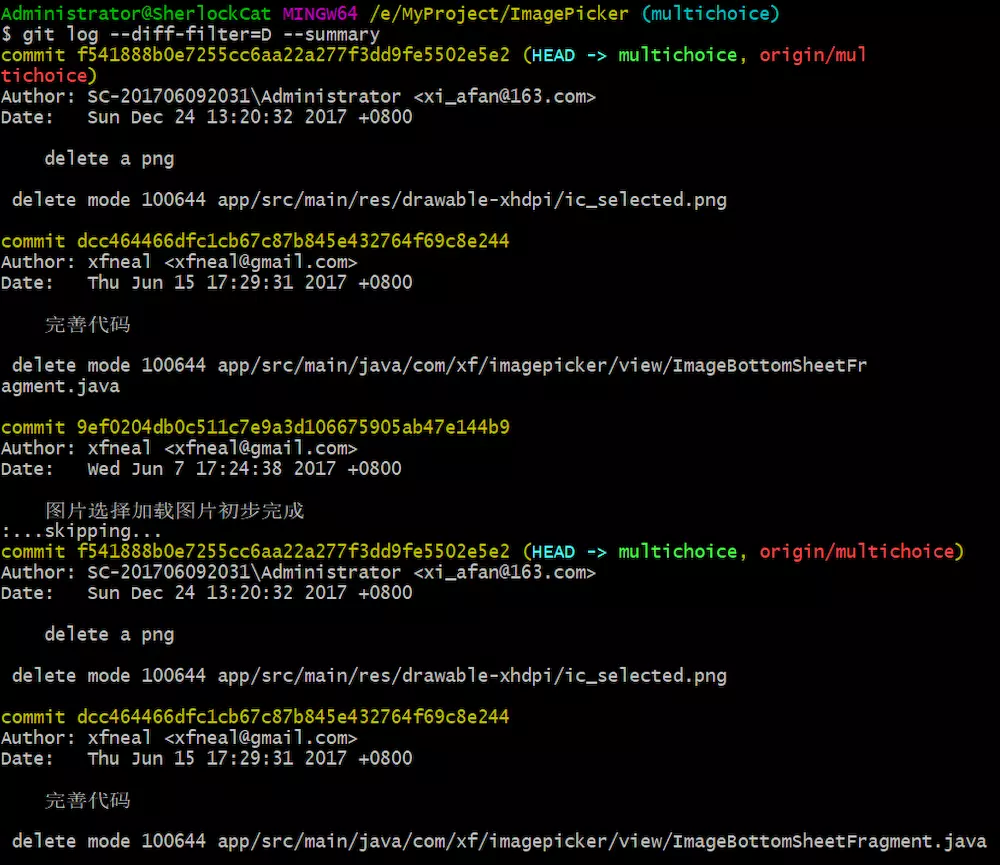
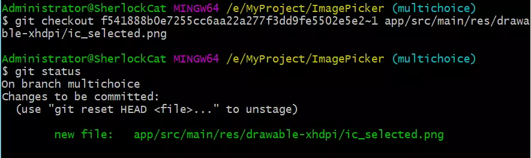

git 其实本身就可以恢复被删除的文件。几个命令就可以了。

大多数我们是不知道在何时删除了某个文件，通过下面这个命令我们可以查看在哪个 commit 中删除了哪些文件。

```shell
git log --diff-filter=D --summary
```

执行这个命令后效果如下：



比如我想恢复 ic_selected.png  这个文件，我们可以看到删除该文件对应的 commit id :**f541888b0e7255cc6aa22a277f3dd9fe5502e5e2**。

接下来我们执行下面这个命令

```shell
git checkout $commit~1 filename
```

这个命令会检出该 commit 的上一个提交中的文件，因为我们是在该 commit 中删除的文件，所以需要在上一个 commit 才能恢复出文件。

执行该命令后的效果



可以看到，执行完我们已经恢复了我们需要的文件。

